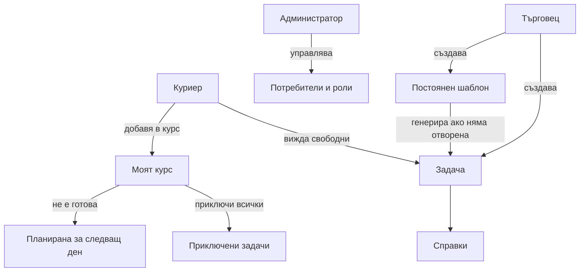

# План за Logistics Orders

Този документ обобщава договорения продукт, направените корекции и посоката за следваща разработка на вътрешното Django приложение за логистика и управление на задачи за доставка/получаване.

## 1. Цел на системата

Да се реализира минимално responsive web приложение за вътрешна логистика, което позволява:

- създаване на задачи за доставка/получаване;
- разпределяне на задачи към куриерски курс;
- бързо приключване на куриерски задачи;
- дневна логистика с ясно разграничение между задачи за днес, пропуснати задачи и планирани напред;
- справки и статистики за търговци/администратори;
- управление на постоянни повтарящи се задачи.

Основният stack е:

- Python
- Django
- server-rendered templates
- Bootstrap 5 + Material-like theme
- минимален JavaScript само там, където е оправдано, например Chart.js за графики

## 2. Потребителски роли

### 2.1. Куриер

Куриерът трябва да може да:

- вижда свободните задачи за разпределяне;
- добавя задача при нужда;
- добавя задача в собствен курс;
- премахва задача от собствен курс, като задачата се връща към свободните за разпределяне;
- приключва задачите от курса си;
- масово приключва задачи с минимални действия.

Важно: премахването от курс не трие задачата и не я приключва. Изтрива се само връзката `CourierCourseItem`, след което задачата отново се вижда като свободна.

### 2.2. Търговец

Търговецът трябва да може да:

- създава задачи;
- гледа списъка със задачи;
- гледа справки, статистики и графики;
- създава постоянни ежедневни/седмични задачи.

### 2.3. Администратор

Администраторът е high IT user / god mode и трябва да може да:

- управлява потребители през Django admin;
- управлява групи/роли;
- управлява задачи, адреси, курсове и постоянни задачи;
- има достъп до всички screens и действия.

Създаването на потребители се прави през Django admin. Не е нужен custom wizard.

## 3. Основни workflows

## 3.1. Създаване на задача

Формата за създаване на задача трябва да е максимално кратка.

Основните полета са:

- `Задача` - свободен текст, ляв панел;
- `Контакти и адрес` - свободен текст, десен панел;
- `Вид` - доставка или получаване;
- `Спешност` - ниска, нормална, висока, спешна;
- `Дата` - по подразбиране днес;
- `Срок` - до обяд или до края на деня;
- `Забележка` - допълнителна инструкция към куриера.

Идеята е човекът, който кара задачата, да има всичко необходимо в `Контакти и адрес`: адрес, лице за контакт, телефон, вход, етаж, инструкции.

Заглавието на задачата се извлича автоматично от първия ред на свободния текст `Задача`.

## 3.2. Основен списък със задачи `/tasks/`

По подразбиране списъкът трябва да показва само задачи, които са:

- активни;
- неприключени;
- свободни, тоест не са взети от куриер в курс.

Default сортиране:

1. първо по спешност, най-спешните най-горе;
2. след това по срок, най-скоро за доставка/получаване най-горе;
3. след това по дата на създаване.

Потребителят трябва да може да сменя филтрите:

- статус: активни, приключени, всички;
- разпределяне: свободни, взети, всички;
- тип: доставка, получаване, всички;
- спешност;
- сортиране: спешност + срок, срок най-скоро, срок най-късно, само спешност.

## 3.3. Куриерски курс

Куриерът може да добавя задачи в собствен курс.

В `Моят курс` задачите се обработват с минимални действия:

- ако всичко е готово, куриерът натиска `Приключи всички`;
- ако някои задачи не са готови, куриерът отбелязва само тях като `Не е готова`;
- след това натиска `Приключи всички без неготовите`;
- неотбелязаните се приключват;
- отбелязаните неготови се планират за следващия ден.

Това е оптимизирано за сценария, в който куриерите на следващия ден вземат новите задачи и приключват масово старите.

## 3.4. Дневна логистика

Всеки ден започва нова логистика.

Задачите могат да бъдат:

- нови за текущия ден;
- планирани за бъдещ ден;
- пропуснати от предишен ден;
- приключени.

Пропуснатите задачи не трябва автоматично да се скриват или да се местят без яснота. Те трябва да се виждат като натрупване към дневната логистика.

Справките трябва да показват:

- планирани за избрания ден;
- активни за деня;
- пропуснати преди деня;
- общо за обработка;
- приключени на деня;
- спешни активни;
- тенденция за последните 30 дни.

## 3.5. Постоянни задачи

Трябва да има опция за задаване на постоянни задачи, достъпна само за търговец и администратор.

Примери:

- всеки ден в 14:00 да се вземат картите от Борика;
- всеки понеделник в 09:00 да се вземат пратките на Гопет.

Постоянната задача се въвежда еднократно като шаблон.

Правила:

- шаблонът може да е ежедневен или седмичен;
- седмичният шаблон има ден от седмицата;
- шаблонът има час;
- при отваряне на дневния списък/справки се генерира задача за деня, ако шаблонът важи за този ден;
- ако има неприключена задача от същия шаблон, не се генерира нова;
- ако задачата е пропусната, не се дублира на следващия ден, защото тя трябва да бъде приключена или обработена като пропусната.

## 4. Модели и данни

## 4.1. `Task`

Основен модел за задача.

Ключови полета:

- `type` - доставка/получаване;
- `title` - кратко заглавие, генерирано от първия ред на задачата;
- `description` - пълен свободен текст на задачата;
- `address_text` - контакти и адрес като свободен текст;
- `location_note` - кратка забележка;
- `created_by`;
- `created_at`;
- `due_at`;
- `urgency`;
- `status`;
- `done_at`;
- `done_by`;
- `recurring_template` - връзка към шаблон за постоянна задача, ако е генерирана от такъв.

## 4.2. `CourierCourseItem`

Свързва куриер със задача в неговия курс.

Правило: `(courier, task)` е уникална двойка.

Премахването на `CourierCourseItem` не трие задачата.

## 4.3. `RecurringTaskTemplate`

Шаблон за постоянни задачи.

Ключови полета:

- `task_text`;
- `contact_address`;
- `note`;
- `type`;
- `urgency`;
- `frequency` - всеки ден или всяка седмица;
- `weekday` - само за седмични задачи;
- `due_time`;
- `is_active`;
- `created_by`;
- `created_at`.

## 4.4. `Address`

Запазени адреси съществуват като модел, но интерфейсът за кратко подаване на задача е преработен към свободен текст `Контакти и адрес`.

Причина: в реалната работа често освен адрес трябват и телефон, контакт, вход, етаж, бележки. Това е по-практично за MVP.

В бъдеще може да се върне комбиниран UX:

- избор от запазен адрес;
- автоматично попълване на контакт/адрес;
- свободно дописване за конкретната задача.

## 5. Permissions

## 5.1. Групи

Използват се Django groups:

- `courier`;
- `merchant`.

Администраторът е `is_staff`/`is_superuser`.

## 5.2. Достъп

- `/tasks/` - login required;
- `/tasks/new/` - courier, merchant, admin;
- `/course/` - courier, admin;
- `/reports/` - merchant, admin;
- `/recurring/` и `/recurring/new/` - merchant, admin;
- `/admin/` - Django admin permissions.

## 6. Интерфейс

UI насоки:

- интерфейсът да бъде изцяло на български;
- бутоните да не се наслагват върху статуси;
- действията за куриер да са отделна колона;
- logout да е POST форма, не GET link;
- графиките да имат фиксирана височина и да не раздуват страницата;
- формите да са кратки и фокусирани върху реалния workflow;
- default изгледът в `/tasks/` да показва само свободни активни задачи.

Използвани UI решения:

- Bootstrap 5;
- Bootswatch Materia theme;
- Bootstrap Icons;
- Chart.js само за справки.

## 7. Справки и графики

Справките са дневно ориентирани.

Основен screen: `/reports/`.

Функции:

- избор на дата;
- KPI cards;
- компактни графики;
- графика за планирани задачи по срок за 30 дни;
- графика за активни задачи по спешност;
- фиксирана височина на canvas контейнерите.

Важно: справките не трябва да променят задачите скрито. Те могат да генерират постоянни задачи за текущия ден, но не трябва автоматично да местят пропуснати задачи.

## 8. Техническа архитектура

Основни файлове:

- `config/settings.py` - Django settings, timezone `Europe/Sofia`, auth redirects;
- `config/urls.py` - root URLs;
- `logistics/models.py` - модели;
- `logistics/forms.py` - форми;
- `logistics/views.py` - server-rendered views;
- `logistics/services.py` - helper logic за due dates и recurring generation;
- `logistics/authz.py` - role checks;
- `logistics/context_processors.py` - role flags in templates;
- `logistics/admin.py` - Django admin registrations;
- `logistics/tests.py` - regression tests;
- `templates/` - HTML templates.

## 9. Текущо състояние на проекта

Към момента приложението има:

- Django project/app skeleton;
- роли courier/merchant/admin;
- management command `bootstrap_roles`;
- модели за задачи, курсове и постоянни задачи;
- кратка форма за задача;
- списък задачи с default filter `активни + свободни`;
- куриерски курс;
- bulk done workflow;
- recurring task templates;
- справки и графики;
- tests.

Проверка:

```bash
. .venv/bin/activate
python manage.py test
python manage.py check
```

Последно тестовете минаваха с:

```text
11 tests OK
System check identified no issues
```

## 10. Git контекст

В repo-то имаше две начални истории:

- `main` с remote initial commit;
- `master` с първия Django app commit.

Беше направен merge на app commit-а към `main` с `--allow-unrelated-histories`, като конфликтът беше само в `.gitignore`.

Ако се продължава в нов chat/agent, първо да се провери:

```bash
git status --short --branch
git log --oneline --decorate --graph --all -10
git remote -v
```

Да не се прави force push без изрично одобрение.

## 11. Следващи препоръчителни задачи

## 11.1. Production readiness

- `.env` support за `SECRET_KEY`, `DEBUG`, `ALLOWED_HOSTS`;
- отделни settings за development/production;
- static files setup;
- database config през environment;
- deployment notes.

## 11.2. UX подобрения

- по-добър mobile layout за таблиците;
- quick actions за куриер директно от task card;
- task cards за мобилен режим вместо таблица;
- по-ясна визуализация на пропуснати задачи;
- badge за `взета от куриер`.

## 11.3. Recurring задачи

- screen за редакция на recurring шаблон;
- screen за спиране/активиране;
- manual generate button за избрана дата;
- audit trail кога е генерирана задача от шаблон.

## 11.4. Адреси

- комбинирана address book логика;
- запазени контакти/адреси;
- autocomplete/select за често използвани адреси;
- snapshot към задачата, за да не се променя историята при редакция на адрес.

## 11.5. Отчети

- CSV export;
- филтри по период;
- филтри по куриер;
- филтри по създател;
- средно време до приключване;
- пропуснати задачи по дни.

## 11.6. Audit и история

- запис на събития:
  - създадена задача;
  - взета в курс;
  - махната от курс;
  - приключена;
  - прехвърлена за следващ ден;
  - генерирана от постоянен шаблон.

## 12. Mermaid диаграма



